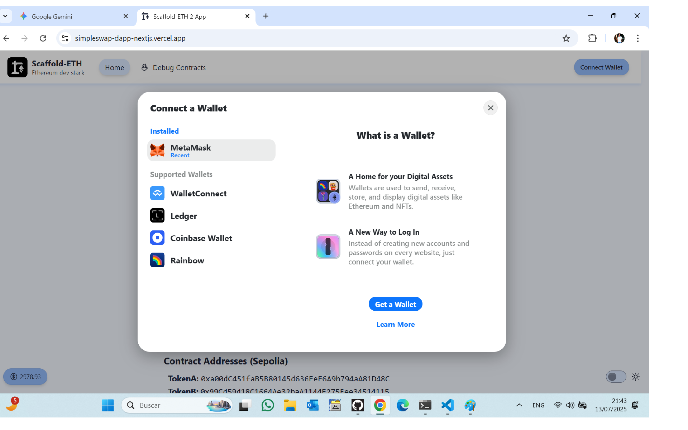
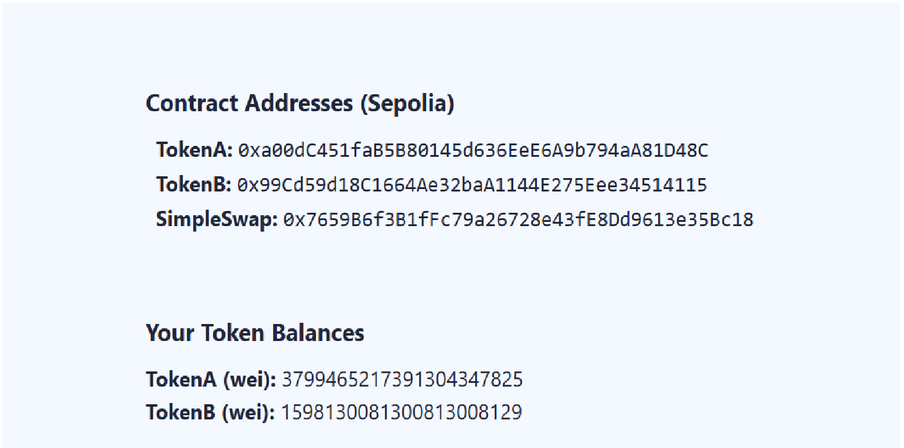
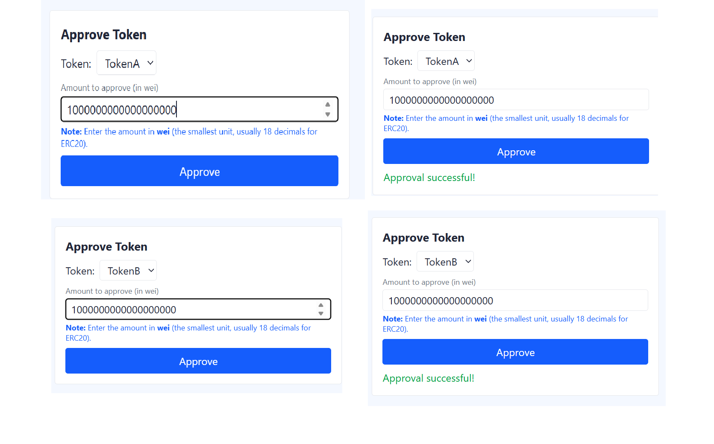
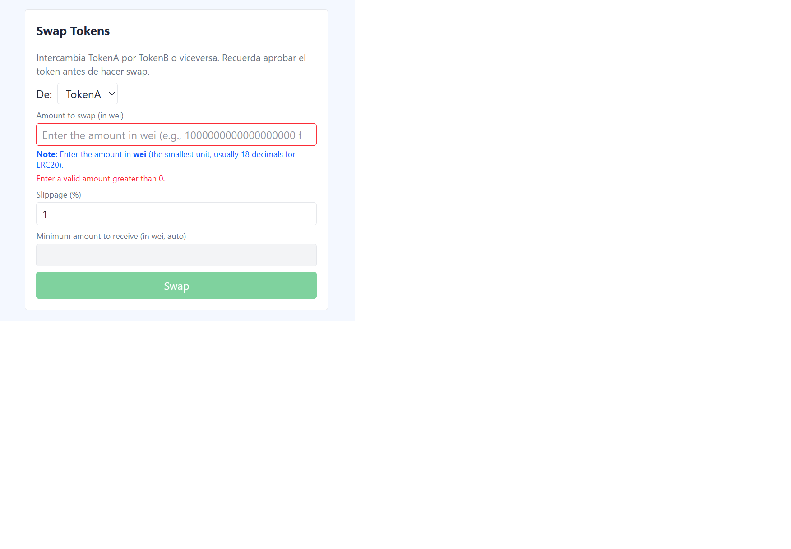
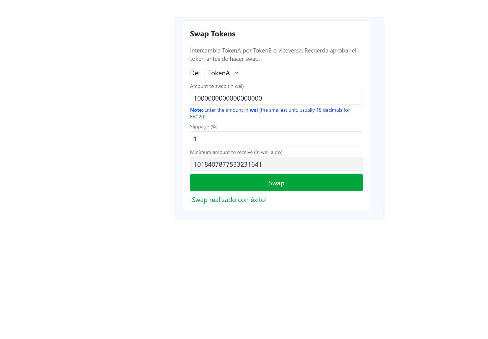
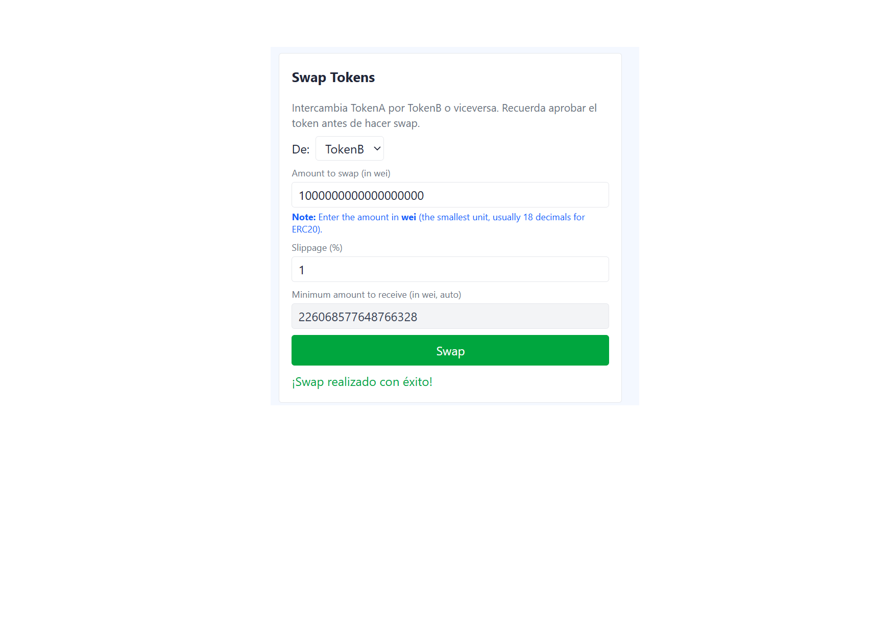
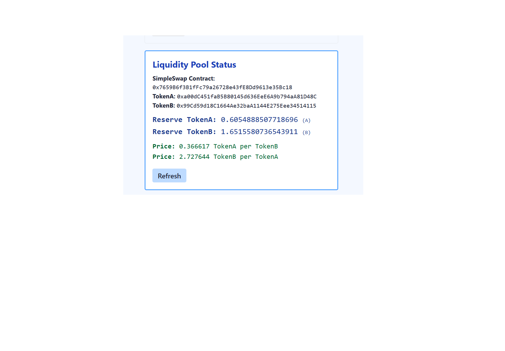
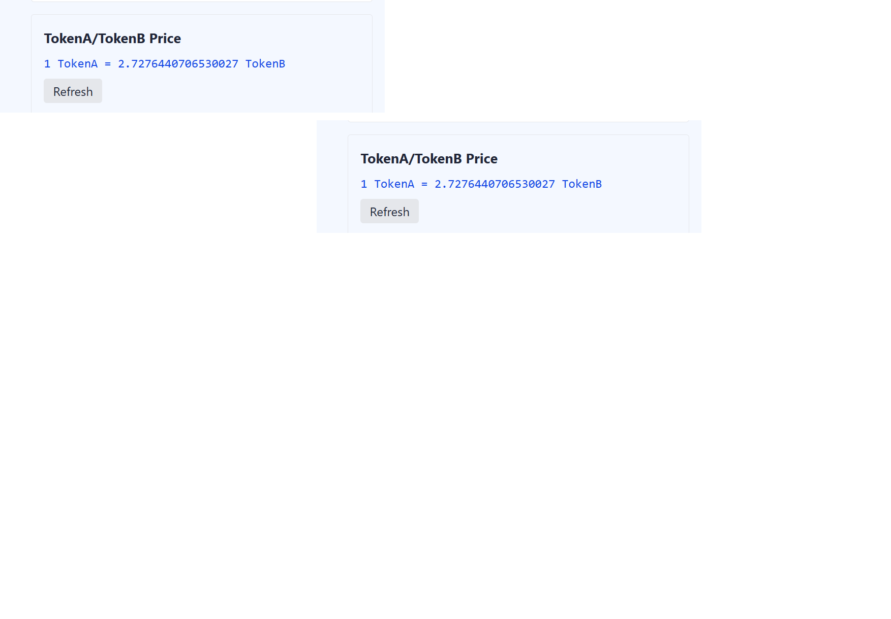

# Screenshots: Interacción con cada función del contrato

A continuación se muestran las pantallas principales del dApp, cada una acompañada de una breve explicación y su screenshot local. Esto permite verificar el cumplimiento de los requisitos del práctico y facilita la evaluación.

## 1️⃣ Conectar Wallet
Permite al usuario conectar su billetera (MetaMask, WalletConnect, etc.) para interactuar con el contrato.


## 2️⃣ Ver Saldos de Tokens
Muestra los saldos actuales de TokenA y TokenB del usuario conectado.


## 3️⃣ Faucet (Obtener Tokens de Prueba)
Permite al usuario obtener TokenA y TokenB para pruebas, facilitando la interacción con el contrato.


## 4️⃣ Aprobar Tokens (Approve)
El usuario debe aprobar el contrato para que pueda gastar sus tokens antes de realizar un swap.


## 5️⃣ Swap de Tokens
Formulario para intercambiar TokenA por TokenB o viceversa, con selección de dirección, monto y slippage.


### Swap TokenA → TokenB


### Swap TokenB → TokenA


## 6️⃣ Ver Precio y Reservas del Pool
La UI muestra el precio actual y las reservas de liquidez en tiempo real.



## 7️⃣ Hash de Transacción y Auditoría
Después de cada acción, la dApp muestra el hash de la transacción y un enlace para auditar en Etherscan.


---

## Important Note on Amounts and Decimals

All token amounts in the dApp are handled in wei, which is the smallest unit according to the token's decimals (usually 18 decimals for ERC20 tokens). The UI allows you to enter values in decimal format (e.g., "1" for 1 token), but all contract interactions use the correct wei value under the hood. This ensures there is no confusion:

- **Example:** If you enter "1" in the amount field, the dApp will send 1e18 wei to the contract for a token with 18 decimals.
- **Always enter amounts as decimals in the UI.**
- **All balances and pool values are displayed in human-readable decimal format.**
## Example Screenshots for Practical Requirements

Below are screenshots demonstrating each main requirement:

### 1. Wallet Connection
Shows the wallet connect modal and successful connection.


### 2. Swap TokenA → TokenB
User swaps TokenA for TokenB using the swap form.


### 3. Swap TokenB → TokenA
User swaps TokenB for TokenA using the swap form.


### 4. Price Display
The UI shows the current price of TokenA in terms of TokenB and vice versa, updated in real time.


# SimpleSwap DApp – Practical Assignment (Module 3)

---

## Project Overview
SimpleSwap is a decentralized application (dApp) for swapping two ERC20 tokens (TokenA and TokenB) using a custom AMM contract. The project includes:
- Smart contracts (Solidity, Hardhat)
- Modern front-end (Next.js, Scaffold-ETH 2, wagmi, RainbowKit)
- Full wallet integration and user-friendly UI
- Automated tests and coverage (Hardhat)

---

## Contract Addresses (Sepolia)
- **SimpleSwap:** `0x7659B6f3B1fFc79a26728e43fE8Dd9613e35Bc18`
- **TokenA:** `0xa00dC451faB5B80145d636EeE6A9b794aA81D48C`
- **TokenB:** `0x99Cd59d18C1664Ae32baA1144E275Eee34514115`

---

## Live Demo
Interact with the deployed dApp:
**https://simpleswap-dapp-nextjs.vercel.app/**

---

## Instructor/User Guide: How to Evaluate the dApp

1. **Open the dApp**
   - Go to [https://simpleswap-dapp-nextjs.vercel.app/](https://simpleswap-dapp-nextjs.vercel.app/)

2. **Connect your wallet**
   - Click "Connect Wallet" (top right).
   - Select MetaMask, WalletConnect, etc.
   - Make sure your wallet is on the **Sepolia** network.

3. **Verify contract addresses**
   - The dApp is connected to:
     - TokenA: `0xa00dC451faB5B80145d636EeE6A9b794aA81D48C`
     - TokenB: `0x99Cd59d18C1664Ae32baA1144E275Eee34514115`
     - SimpleSwap: `0x7659B6f3B1fFc79a26728e43fE8Dd9613e35Bc18`
   - These addresses are visible in the UI and/or codebase.

4. **Get test tokens (Faucet)**
   - Use the "Faucet" section to mint TokenA and TokenB to your wallet.

5. **View the liquidity pool**
   - The UI displays the current pool reserves for TokenA and TokenB.
   - If the pool is empty, a message will indicate no liquidity is available.
   - If there is liquidity, you will see the balances and the current price (e.g., 1 TokenA = 1 TokenB if balanced).

6. **Approve tokens**
   - In the "Approve" section, select the token and amount to approve.
   - Enter the amount in decimal units (e.g., 10, not in wei).
   - Click "Approve" and confirm in your wallet.

7. **Swap tokens**
   - In the "Swap" section, select TokenA → TokenB or vice versa.
   - Enter the amount to swap (must not exceed your balance or pool reserves).
   - Click "Swap" and confirm in your wallet.
   - The dApp will show the transaction hash and a link to Etherscan.

8. **Check real-time price and pool info**
   - The UI updates the price and pool reserves after each swap.

9. **Audit transactions**
   - After each operation, click the transaction hash to view details on Etherscan.

---

## Front-End Usage Instructions

1. **Connect your wallet** (MetaMask, WalletConnect, etc.)
2. **Get test tokens** using the Faucet (if available)
3. **Approve tokens** before swapping
4. **Swap tokens** in either direction
5. **View pool reserves and price** in real time
6. **Audit transactions** via Etherscan links

---

## Pool and Contract Info in the UI
- The dApp displays:
  - Pool reserves for TokenA and TokenB
  - Current price (TokenA/TokenB)
  - Contract addresses in use (visible in the UI or via the code)

---

## Development & Testing Environment

### Requirements
- Node.js >= 18
- Hardhat
- Yarn or npm

### Local Setup
1. **Install dependencies:**
   ```bash
   yarn install
   # or
   npm install
   ```
2. **Start Hardhat node and deploy contracts:**
   ```bash
   cd packages/hardhat
   npx hardhat node
   npx hardhat deploy --network localhost
   ```
3. **Run the front-end:**
   ```bash
   cd packages/nextjs
   yarn dev
   # or
   npm run dev
   ```
4. **Open** [http://localhost:3000](http://localhost:3000) in your browser.

---

## Testing & Coverage

- The project uses Hardhat for testing and coverage.
- To run tests and check coverage:
  ```bash
  cd packages/hardhat
  npx hardhat test
  npx hardhat coverage
  ```
- **Coverage achieved:** ≥50% (see `coverage/` folder for detailed report)

---

## Features Implemented
- Connect wallet (RainbowKit, wagmi)
- Approve tokens for swap
- Swap TokenA ↔ TokenB (with slippage and min received auto-calculation)
- View price and pool reserves
- Faucet for test tokens
- Responsive, user-friendly UI
- Full NatSpec documentation in contracts
- Test coverage ≥ 50%

---

## Example Transaction Hash in the UI

After each swap or approve, the dApp displays the transaction hash and a direct link to Etherscan for auditing:

```
Transaction sent:
0x1234abcd...5678efgh
View on Etherscan
```

Clicking "View on Etherscan" opens the transaction details in the block explorer.

---


---

## Example Screenshots

Below are example screenshots of the main dApp features:

### Main Page
Shows the dApp title, wallet connect button, and navigation.


### Pool Info and Price
Displays current reserves for TokenA and TokenB, and the real-time price.


### Swap Tokens
Form to swap TokenA for TokenB or vice versa, with amount and slippage settings.


### Approve Tokens
Approve the contract to spend your tokens before swapping.


### Transaction Hash Display
After each action, the dApp shows the transaction hash and a link to Etherscan.


---

## Author
Eduardo Moreno

## Overview
This project implements a decentralized application (dApp) for token swapping using a custom AMM contract (`SimpleSwap`) and two ERC20 tokens (`TokenA` and `TokenB`). The solution includes:
- Smart contracts (Solidity, Hardhat)
- A modern front-end (Next.js, Scaffold-ETH 2, wagmi, RainbowKit)
- Full wallet integration and user-friendly UI
- Automated tests and coverage

---

## Contract Addresses (Deployed for Module 3)
- **SimpleSwap:** `0x7659B6f3B1fFc79a26728e43fE8Dd9613e35Bc18`
- **TokenA:** `0xa00dC451faB5B80145d636EeE6A9b794aA81D48C`
- **TokenB:** `0x99Cd59d18C1664Ae32baA1144E275Eee34514115`

---


## Live Demo

You can interact with the deployed dApp here:

**https://simpleswap-dapp-nextjs.vercel.app/**

---

## Step-by-Step: How to Use the Front-End

1. **Open the dApp**
   - Go to [https://simpleswap-dapp-nextjs.vercel.app/](https://simpleswap-dapp-nextjs.vercel.app/)

2. **Connect Your Wallet**
   - Click the **Connect Wallet** button at the top right.
   - Select your preferred wallet (MetaMask, WalletConnect, etc.) and approve the connection.

3. **Get Test Tokens (Optional)**
   - Use the **Faucet** section to mint test TokenA or TokenB to your wallet for demo purposes.

4. **Approve Token**
   - Before swapping, you must approve the SimpleSwap contract to spend your tokens.
   - In the **Approve** section:
     - Select the token you want to swap (TokenA or TokenB).
     - Enter the amount to approve.
     - Click **Approve** and confirm the transaction in your wallet.
    - **¿Qué monto ingresar?**
      - Ingresa el monto en unidades decimales (por ejemplo, 1, 10, 100), no en wei.
      - La dApp convierte automáticamente el valor a wei (la unidad mínima del token) antes de enviarlo al contrato.
      - Si el token tiene 18 decimales (como la mayoría de los ERC20), 1 token = 1 000 000 000 000 000 000 (1e18) wei.
      - Ejemplo: Si quieres aprobar 10 TokenA, escribe “10” en el campo de monto. La dApp enviará 10 000 000 000 000 000 000 wei al contrato.
      - Puedes aprobar exactamente el monto que vas a intercambiar, o un poco más si prefieres no repetir el approve en cada swap.

5. **Swap Tokens**
   - In the **Swap** section:
     - Select the direction (TokenA → TokenB or TokenB → TokenA).
     - Enter the amount to swap.
     - Set your desired slippage tolerance (default: 1%).
     - The minimum amount to receive will be calculated automatically.
     - Click **Swap** and confirm the transaction in your wallet.

6. **View Price and Pool Info**
   - The UI displays the current price and liquidity pool reserves in real time.

7. **Done!**
   - You can repeat the process, swap in both directions, and explore all features.

---

## How to Run Locally

1. **Install dependencies:**
   ```bash
   yarn install
   # or
   npm install
   ```
2. **Start Hardhat node and deploy contracts:**
   ```bash
   cd packages/hardhat
   npx hardhat node
   npx hardhat deploy --network localhost
   ```
3. **Run the front-end:**
   ```bash
   cd packages/nextjs
   yarn dev
   # or
   npm run dev
   ```
4. **Open** [http://localhost:3000](http://localhost:3000) in your browser.

---

## Testing & Coverage

- The project uses Hardhat for testing and coverage.
- To run tests and check coverage:
  ```bash
  cd packages/hardhat
  npx hardhat test
  npx hardhat coverage
  ```
- **Coverage achieved:** >50% (see `coverage/` folder for detailed report)

---

## Features Implemented
- Connect wallet (RainbowKit, wagmi)
- Approve tokens for swap
- Swap TokenA ↔ TokenB (with slippage and min received auto-calculation)
- View price and pool reserves
- Faucet for test tokens
- Responsive, user-friendly UI
- Full NatSpec documentation in contracts
- Test coverage ≥ 50%

---

## Instructor Notes
- All contract addresses are declared above.
- The UI guides the user through every required step: connect, approve, swap, and view info.
- The codebase is clean, well-documented, and ready for review.
- For any questions, contact: eduardomoreno2503@gmail.com

---

## Verification
- All contracts are verified and source code is available in the repository.
- To verify on a block explorer, use the provided source and ABI files in `artifacts/`.

---

## Interacción con Etherscan

La dApp SimpleSwap facilita la auditoría y seguimiento de las operaciones en la blockchain mediante enlaces directos a Etherscan:

- **Contratos desplegados:**
  - [SimpleSwap en Etherscan](https://etherscan.io/address/0x7659B6f3B1fFc79a26728e43fE8Dd9613e35Bc18)
  - [TokenA en Etherscan](https://etherscan.io/address/0xa00dC451faB5B80145d636EeE6A9b794aA81D48C)
  - [TokenB en Etherscan](https://etherscan.io/address/0x99Cd59d18C1664Ae32baA1144E275Eee34514115)

- **Transacciones:**
  - Cada vez que realizas un swap o apruebas tokens, la interfaz muestra el hash de la transacción con un enlace directo a Etherscan para su consulta y verificación.

- **Cómo usarlo:**
  1. Realiza cualquier operación (swap, approve) desde la dApp.
  2. Al finalizar, haz clic en el hash de la transacción que aparece en pantalla.
  3. Se abrirá Etherscan mostrando todos los detalles de la operación, permitiendo auditar el resultado y el estado en la red.

Esto garantiza transparencia y confianza, permitiendo a cualquier usuario o evaluador verificar el funcionamiento real del sistema en la blockchain pública.
 
**Ejemplo visual:**


```
Transacción enviada: 
0x1234abcd...5678efgh
Ver en Etherscan
```

Al hacer clic en "Ver en Etherscan", se abre la página de la transacción en el block explorer, mostrando todos los detalles y confirmaciones.

---

## Author
Eduardo Moreno

---

## Capturas de pantalla y pruebas funcionales

Consulta el archivo [`README-capturas.md`](./README-capturas.md) para ver capturas de pantalla y el detalle de todas las pruebas funcionales realizadas sobre el despliegue en Vercel.
