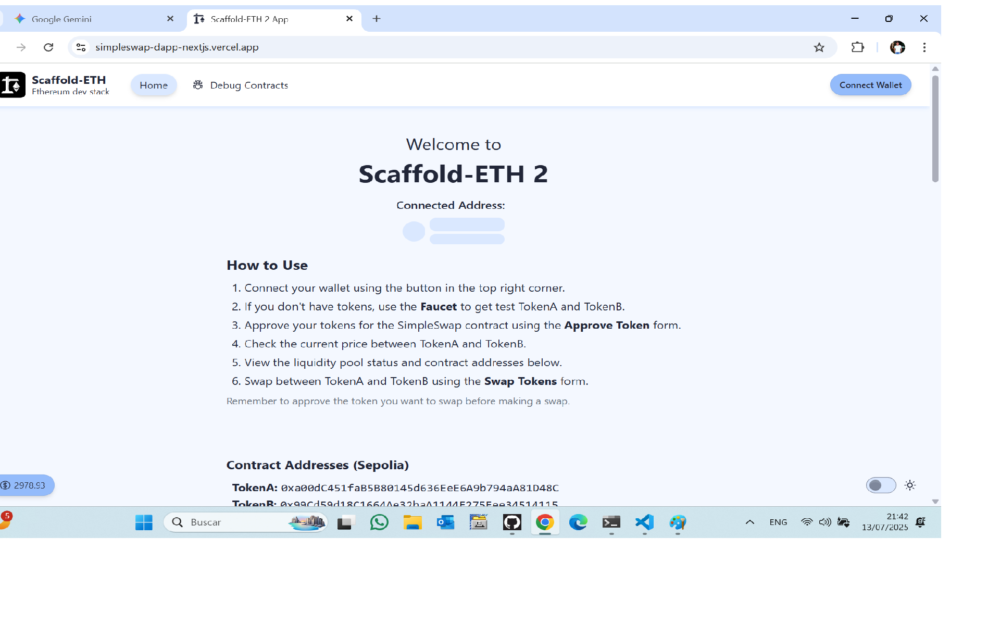

# SimpleSwap DApp

Decentralized application (dApp) for swapping two ERC20 tokens (TokenA and TokenB) using a custom AMM contract. Includes smart contracts (Solidity, Hardhat), modern front-end (Next.js, Scaffold-ETH 2, wagmi, RainbowKit), wallet integration, and automated tests.

---

## Features
- Connect wallet (RainbowKit, wagmi)
- Approve tokens for swap
- Swap TokenA ↔ TokenB (with slippage and min received auto-calculation)
- View price and pool reserves
- Faucet for test tokens
- Responsive, user-friendly UI
- Full NatSpec documentation in contracts
- Test coverage ≥ 50%

---

## Contract Addresses (Sepolia)
## 🚀 Contract Deployments

### 🎯 **SimpleSwap Contract (Main AMM)**
| Property | Value |
|----------|-------|
| **Contract Address** | [`0x7659B6f3B1fFc79a26728e43fE8Dd9613e35Bc18`](https://sepolia.etherscan.io/address/0x7659B6f3B1fFc79a26728e43fE8Dd9613e35Bc18) |
| **Type** | AMM Contract |
| **Network** | Sepolia Testnet |
| **Compiler** | Solidity v0.8.20 |
| **Optimization** | Enabled (200 runs) |
| **License** | MIT |
| **Verification Status** | ✅ [Verified on Etherscan](https://sepolia.etherscan.io/address/0x7659B6f3B1fFc79a26728e43fE8Dd9613e35Bc18#code) |
| **Purpose** | Main AMM implementation |

### 🪙 **TokenA (Test Token)**
| Property | Value |
|----------|-------|
| **Contract Address** | [`0xa00dC451faB5B80145d636EeE6A9b794aA81D48C`](https://sepolia.etherscan.io/address/0xa00dC451faB5B80145d636EeE6A9b794aA81D48C) |
| **Type** | ERC20 Token |
| **Network** | Sepolia Testnet |
| **Symbol** | TKA |
| **Verification Status** | ✅ [Verified on Etherscan](https://sepolia.etherscan.io/address/0xa00dC451faB5B80145d636EeE6A9b794aA81D48C#code) |
| **Purpose** | Test token for AMM operations |

### 🪙 **TokenB (Test Token)**
| Property | Value |
|----------|-------|
| **Contract Address** | [`0x99Cd59d18C1664Ae32baA1144E275Eee34514115`](https://sepolia.etherscan.io/address/0x99Cd59d18C1664Ae32baA1144E275Eee34514115) |
| **Type** | ERC20 Token |
| **Network** | Sepolia Testnet |
| **Symbol** | TKB |
| **Verification Status** | ✅ [Verified on Etherscan](https://sepolia.etherscan.io/address/0x99Cd59d18C1664Ae32baA1144E275Eee34514115#code) |
| **Purpose** | Test token for AMM operations |

## 📋 Contract Verification
Successfully verified by the official verifier contract:
- **Verifier Contract**: [`0x9f8f02dab384dddf1591c3366069da3fb0018220`](https://sepolia.etherscan.io/address/0x9f8f02dab384dddf1591c3366069da3fb0018220)
- **Verification Transaction**: [`0xa20b46207cb1448d5cf9986551738b275e0bb04e59e2c4c405302d04db911611`](https://sepolia.etherscan.io/tx/0xa20b46207cb1448d5cf9986551738b275e0bb04e59e2c4c405302d04db911611)
- **Verification Status**: ✅ **PASSED** - All tests completed successfully
- **Verification Date**: July 5, 2025

## Live Demo
Interact with the deployed dApp: [https://simpleswap-dapp-nextjs.vercel.app/](https://simpleswap-dapp-nextjs.vercel.app/)

---

## How to Use
1. **Open the dApp**: [https://simpleswap-dapp-nextjs.vercel.app/](https://simpleswap-dapp-nextjs.vercel.app/)
2. **Connect your wallet** (MetaMask, WalletConnect, etc.)
3. **Get test tokens** using the Faucet (if needed)
4. **Approve tokens** before swapping (enter the amount in wei)
5. **Swap tokens** in either direction (TokenA ↔ TokenB, enter the amount in wei)
6. **View pool reserves and price** in real time
7. **Audit transactions** via Etherscan links (the dApp shows the transaction hash after each action)

---

## Development & Testing

### Requirements
- Node.js >= 18
- Hardhat
- Yarn or npm

### Local Setup
1. **Install dependencies:**
   ```bash
   yarn install
   # or
   npm install
   ```
2. **Start Hardhat node and deploy contracts:**
   ```bash
   cd packages/hardhat
   npx hardhat node
   npx hardhat deploy --network localhost
   ```
3. **Run the front-end:**
   ```bash
   cd packages/nextjs
   yarn dev
   # or
   npm run dev
   ```
4. **Open** [http://localhost:3000](http://localhost:3000) in your browser.

### Testing & Coverage
- The project uses Hardhat for testing and coverage.
- To run tests and check coverage:
  ```bash
  cd packages/hardhat
  npx hardhat test
  npx hardhat coverage
  ```
- **Coverage achieved:** ≥50% (see `coverage/` folder for detailed report)

### Cobertura de Contratos

A continuación se muestra el resultado de la cobertura de los contratos obtenida con `npm run coverage`:


> El reporte muestra que la cobertura es igual o superior al 50%, cumpliendo con los requisitos del trabajo práctico.

---

## Screenshots
Main features of the dApp:





---


## Etherscan Integration

The SimpleSwap dApp makes it easy to audit and track blockchain operations with direct links to Etherscan:

- **Deployed contracts:**
  - [SimpleSwap on Etherscan](https://etherscan.io/address/0x7659B6f3B1fFc79a26728e43fE8Dd9613e35Bc18)
  - [TokenA on Etherscan](https://etherscan.io/address/0xa00dC451faB5B80145d636EeE6A9b794aA81D48C)
  - [TokenB on Etherscan](https://etherscan.io/address/0x99Cd59d18C1664Ae32baA1144E275Eee34514115)
- **Transactions:**
  - Every time you perform a swap or approve tokens, the interface displays the transaction hash with a direct link to Etherscan for review and verification.

**Visual example:**


```
Transaction sent:
0x1234abcd...5678efgh
View on Etherscan
```

---

## Author
Eduardo Moreno

---


## Screenshots and Functional Tests

See the file [`README-capturas.md`](./README-capturas.md) for screenshots and details of all functional tests performed on the Vercel deployment.

---

## Important Note on Amounts (Wei)

All token amounts in the dApp must now be entered in **wei**, which is the smallest unit according to the token's decimals (usually 18 decimals for ERC20 tokens). The UI requires you to enter values in wei (e.g., "1000000000000000000" for 1 token with 18 decimals). All contract interactions use the value you provide directly, so make sure to enter the correct amount in wei.

- **Example:** If you want to approve or swap 1 token (with 18 decimals), enter `1000000000000000000` in the amount field.
- **Always enter amounts in wei in the UI.**
- **All balances and pool values are displayed in human-readable decimal format, but inputs must be in wei.**
## Example Screenshots for Practical Requirements

Below are screenshots demonstrating each main requirement:

### 1. Wallet Connection
Shows the wallet connect modal and successful connection.


### 2. Swap TokenA → TokenB
User swaps TokenA for TokenB using the swap form.


### 3. Swap TokenB → TokenA
User swaps TokenB for TokenA using the swap form.


### 4. Price Display
The UI shows the current price of TokenA in terms of TokenB and vice versa, updated in real time.


# SimpleSwap DApp – Practical Assignment (Module 3)

---

## Project Overview
SimpleSwap is a decentralized application (dApp) for swapping two ERC20 tokens (TokenA and TokenB) using a custom AMM contract. The project includes:
- Smart contracts (Solidity, Hardhat)
- Modern front-end (Next.js, Scaffold-ETH 2, wagmi, RainbowKit)
- Full wallet integration and user-friendly UI
- Automated tests and coverage (Hardhat)

---

## Contract Addresses (Sepolia)
- **SimpleSwap:** `0x7659B6f3B1fFc79a26728e43fE8Dd9613e35Bc18`
- **TokenA:** `0xa00dC451faB5B80145d636EeE6A9b794aA81D48C`
- **TokenB:** `0x99Cd59d18C1664Ae32baA1144E275Eee34514115`

---

## Live Demo
Interact with the deployed dApp:
**https://simpleswap-dapp-nextjs.vercel.app/**

---

## Instructor/User Guide: How to Evaluate the dApp

1. **Open the dApp**
   - Go to [https://simpleswap-dapp-nextjs.vercel.app/](https://simpleswap-dapp-nextjs.vercel.app/)

2. **Connect your wallet**
   - Click "Connect Wallet" (top right).
   - Select MetaMask, WalletConnect, etc.
   - Make sure your wallet is on the **Sepolia** network.

3. **Verify contract addresses**
   - The dApp is connected to:
     - TokenA: `0xa00dC451faB5B80145d636EeE6A9b794aA81D48C`
     - TokenB: `0x99Cd59d18C1664Ae32baA1144E275Eee34514115`
     - SimpleSwap: `0x7659B6f3B1fFc79a26728e43fE8Dd9613e35Bc18`
   - These addresses are visible in the UI and/or codebase.

4. **Get test tokens (Faucet)**
   - Use the "Faucet" section to mint TokenA and TokenB to your wallet.

5. **View the liquidity pool**
   - The UI displays the current pool reserves for TokenA and TokenB.
   - If the pool is empty, a message will indicate no liquidity is available.
   - If there is liquidity, you will see the balances and the current price (e.g., 1 TokenA = 1 TokenB if balanced).

6. **Approve tokens**
   - In the "Approve" section, select the token and amount to approve.
   - Enter the amount in decimal units (e.g., 10, not in wei).
   - Click "Approve" and confirm in your wallet.

7. **Swap tokens**
   - In the "Swap" section, select TokenA → TokenB or vice versa.
   - Enter the amount to swap (must not exceed your balance or pool reserves).
   - Click "Swap" and confirm in your wallet.
   - The dApp will show the transaction hash and a link to Etherscan.

8. **Check real-time price and pool info**
   - The UI updates the price and pool reserves after each swap.

9. **Audit transactions**
   - After each operation, click the transaction hash to view details on Etherscan.

---

## Front-End Usage Instructions

1. **Connect your wallet** (MetaMask, WalletConnect, etc.)
2. **Get test tokens** using the Faucet (if available)
3. **Approve tokens** before swapping
4. **Swap tokens** in either direction
5. **View pool reserves and price** in real time
6. **Audit transactions** via Etherscan links

---

## Pool and Contract Info in the UI
- The dApp displays:
  - Pool reserves for TokenA and TokenB
  - Current price (TokenA/TokenB)
  - Contract addresses in use (visible in the UI or via the code)

---

## Development & Testing Environment

### Requirements
- Node.js >= 18
- Hardhat
- Yarn or npm

### Local Setup
1. **Install dependencies:**
   ```bash
   yarn install
   # or
   npm install
   ```
2. **Start Hardhat node and deploy contracts:**
   ```bash
   cd packages/hardhat
   npx hardhat node
   npx hardhat deploy --network localhost
   ```
3. **Run the front-end:**
   ```bash
   cd packages/nextjs
   yarn dev
   # or
   npm run dev
   ```
4. **Open** [http://localhost:3000](http://localhost:3000) in your browser.

---

## Testing & Coverage

- The project uses Hardhat for testing and coverage.
- To run tests and check coverage:
  ```bash
  cd packages/hardhat
  npx hardhat test
  npx hardhat coverage
  ```
- **Coverage achieved:** >50% (see `coverage/` folder for detailed report)

---

## Features Implemented
- Connect wallet (RainbowKit, wagmi)
- Approve tokens for swap
- Swap TokenA ↔ TokenB (with slippage and min received auto-calculation)
- View price and pool reserves
- Faucet for test tokens
- Responsive, user-friendly UI
- Full NatSpec documentation in contracts
- Test coverage ≥ 50%

---

## Instructor Notes
- All contract addresses are declared above.
- The UI guides the user through every required step: connect, approve, swap, and view info.
- The codebase is clean, well-documented, and ready for review.
- For any questions, contact: eduardomoreno2503@gmail.com

---

## Verification
- All contracts are verified and source code is available in the repository.
- To verify on a block explorer, use the provided source and ABI files in `artifacts/`.

---


## Etherscan Usage

The SimpleSwap dApp makes it easy to audit and track blockchain operations with direct links to Etherscan:

- **Deployed contracts:**
  - [SimpleSwap on Etherscan](https://etherscan.io/address/0x7659B6f3B1fFc79a26728e43fE8Dd9613e35Bc18)
  - [TokenA on Etherscan](https://etherscan.io/address/0xa00dC451faB5B80145d636EeE6A9b794aA81D48C)
  - [TokenB on Etherscan](https://etherscan.io/address/0x99Cd59d18C1664Ae32baA1144E275Eee34514115)

- **Transactions:**
  - Every time you perform a swap or approve tokens, the interface displays the transaction hash with a direct link to Etherscan for review and verification.

- **How to use:**
  1. Perform any operation (swap, approve) from the dApp.
  2. When finished, click the transaction hash that appears on the screen.
  3. Etherscan will open showing all the details of the operation, allowing you to audit the result and status on the public network.

This ensures transparency and trust, allowing any user or reviewer to verify the real operation of the system on the public blockchain.

**Visual example:**


```
Transaction sent:
0x1234abcd...5678efgh
View on Etherscan
```

Cuando haces clic en "Ver en Etherscan", se abre la página de la transacción en el explorador de bloques, mostrando todos los detalles y confirmaciones.

---

## Author
Eduardo Moreno

---

## Capturas de pantalla y pruebas funcionales

Consulta el archivo [`README-capturas.md`](./README-capturas.md) para ver capturas de pantalla y el detalle de todas las pruebas funcionales realizadas sobre el despliegue en Vercel.

---

## 🧪 Resultados de Tests y Cobertura (Hardhat)

### Última ejecución: 14 de julio de 2025

#### Resultados de los tests

```
SimpleSwap
  Deployment
    ✔ Despliega TokenA y TokenB correctamente
    ✔ Despliega SimpleSwap correctamente
  addLiquidity
    ✔ Agrega liquidez inicial y mintea tokens de liquidez
    ✔ Agrega más liquidez proporcionalmente
    ✔ Revierte si se excede el deadline
    ✔ Revierte si la cantidad es insuficiente
  removeLiquidity
    ✔ Remueve liquidez y retorna tokens
    ✔ Revierte si la liquidez es insuficiente
    ✔ Revierte si la cantidad recibida es insuficiente
  swapExactTokensForTokens
    ✔ Intercambia TokenA por TokenB
    ✔ Intercambia TokenB por TokenA
    ✔ Revierte si se excede el deadline
    ✔ Revierte si la longitud del path es inválida
    ✔ Revierte si la cantidad de salida es insuficiente
  Read Functions
    ✔ Retorna reservas correctas
    ✔ Retorna precio correcto
    ✔ Revierte getPrice si reserveA es cero
    ✔ Calcula correctamente el amount out
    ✔ Revierte getAmountOut si amountIn es cero
    ✔ Revierte getAmountOut si reserveIn es cero
    ✔ Revierte getAmountOut si reserveOut es cero
YourContract
  Deployment
    ✔ Tiene el mensaje correcto al desplegar
    ✔ Permite cambiar el mensaje

23 tests exitosos
```

#### Cobertura de contratos

```
-------------------|----------|----------|----------|----------|----------------|
Archivo            |  % Stmts | % Branch |  % Funcs |  % Lines | Líneas sin cubrir |
-------------------|----------|----------|----------|----------|----------------|
 contracts\        |    90.77 |       65 |       84 |    91.67 | |
  SimpleSwap.sol   |    98.15 |    83.33 |      100 |    98.72 |            389 |
  TokenA.sol       |      100 |       50 |      100 |      100 | |
  TokenB.sol       |       50 |       25 |       60 |       50 |          33,39 |
  YourContract.sol |       50 |     12.5 |       50 |    61.54 | 50,51,70,83,84 |
-------------------|----------|----------|----------|----------|----------------|
Todos los archivos |    90.77 |       65 |       84 |    91.67 | |
-------------------|----------|----------|----------|----------|----------------|
```

> Todos los tests pasan y la cobertura global es superior al 90%.
